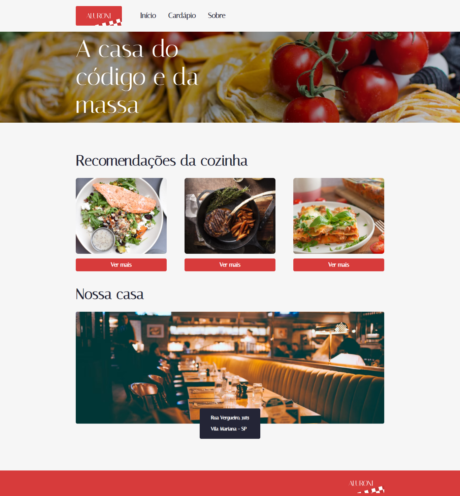

# Alura-Studies

Página de um restaurante desenvolvido durante o curso de React com Typescript
[Link deploy](https://aluronii.netlify.app)

 

### Aulas

[React: lidando com arquivos estáticos](https://cursos.alura.com.br/course/react-arquivos-estaticos)  
[React: conhecendo a biblioteca React Router](https://cursos.alura.com.br/course/react-biblioteca-react-router)

 

### Tecnologias:

- [Create React App](https://create-react-app.dev)
- [React](https://reactjs.org)
- [Typescript](https://www.typescriptlang.org)
- [Sass](https://sass-lang.com)

 

